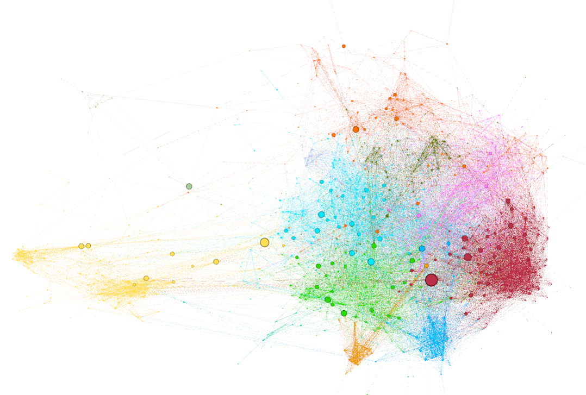
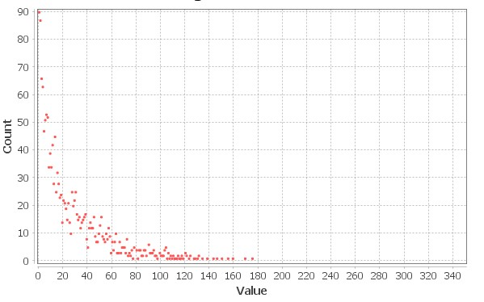
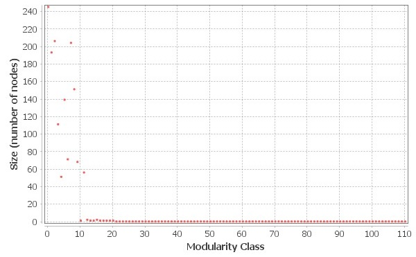
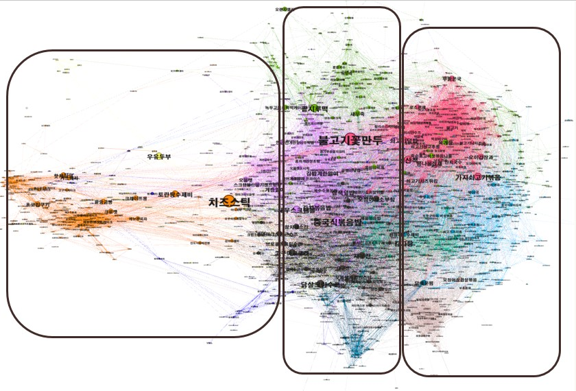
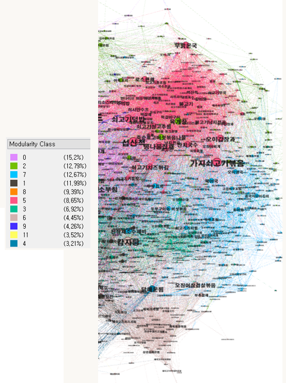
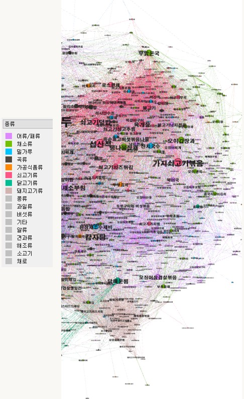

# Recipe Analysis and Network Visualization

요리 레시피들을 그래프를 통해 데이터를 분석하여 레시피들간의 연관성을 파악하고, 기존 레시피 사이트에서는 제공하지 않는 새로운 기능을 제공하는 것을 목적으로 프로젝트를 진행하였다.

## Team

-   김현창
-   박영빈
-   임철수

## Report

-   [pdf](_docs/report.pdf)

 

## Application

-   https://h-spear.github.io/recipe-analysis-and-network-visualization/

## Dataset

-   '<a href='https://www.menupan.com/cook/recipe_search.asp'>메뉴판</a>' 사이트의 1,583개의 레시피

## Visualization

-   [Gephi](https://gephi.org/) 
-   Graph 
    
-   Degree 
    
-   Modularity Class 
    

## Analysis

  
그래프는 크게 세 가지 클래스로 나누어 살펴볼 수 있다. 왼쪽 클래스는 대부분 서양식과 이탈리아식이 분포하고 있었다. 이 클래스에는 '설탕, 버터, 계란’이 재료로 많이 사용되었고, 재료에서도 유추할 수 있듯이 대부분 빵, 과자 레시피들이 분포하고 있었다. 레시피들의 종류도 역시 밀가루 종류가 대부분을 차지하고 있었다.  
가운데 클래스는 다양한 클러스터들이 섞여 있는 클래스이다. 이 부분은 재료나, 방법, 국가 등으로 나누어 살펴봐도 뚜렷하게 영역이 나누어져 있지 않고 레시피들이 얽혀 있는 것을 확인할 수 있다. 퓨전, 한식, 서양식 등 다양한 레시피가 섞여있는 영역인 만큼 여러 종류의 음식들이 종류와 방법을 가리지 않고 섞여 있다고 판단할 수 있다.  
마지막 클래스는 대부분 한식으로 구성된 클래스였다. 마지막 클래스의 색깔을 방법별로 구분하여 분석한 결과, 어떠한 뚜렷한 특징은 나타나지 않았다. 우리나라 사이트인 만큼 볶음, 찌개, 찜, 부침, 국 등 한식에 최적화된 다양한 분류들이 존재하였다. 이 클래스를 종류별로 색깔을 칠하여 분석한 결과 채소류 클러스터, 쇠고기류 클러스터, 돼지고기류 클러스터, 어류/패류 클러스터가 존재하는 것을 확인할 수 있었다. 이를 통해 한식에 다양한 재료가 사용된다는 것을 알 수 있다. 

|      Modularity Class 별로 색칠한 마지막 클래스      |             종류로  색칠한 마지막 클래스             |
| :-----------------------------------------------------: | :-----------------------------------------------------: |
|  |  |

## Scenario

1. 레시피 이름이나 재료로 검색하여 레시피를 찾을 수 있다.
2. 레시피들의 연관성을 다양한 관점에서 볼 수 있다.
3. Degree가 높은 레시피의 재료를 준비하면 다른 많은 레시피를 도전할 수 있다.
4. Betweenness가 높은 레시피의 재료를 준비하면 폭 넓은 다른 레시피를 도전할 수 있다.
